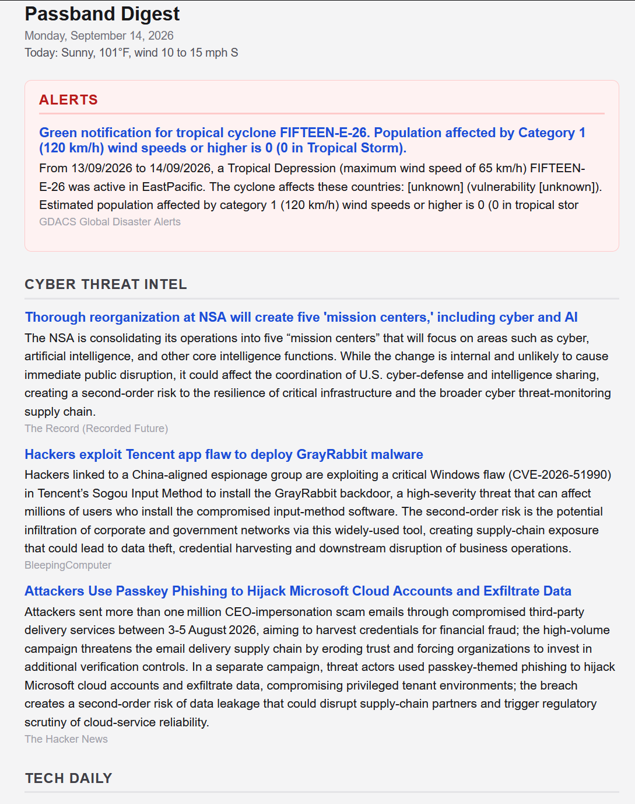

# Passband

A self-hosted pipeline that turns your RSS feeds, plus a few structured public
sources (USGS earthquakes, NWS alerts), into a daily email digest with a hazard
and risk layer on top. Built RSS-first for low, predictable cost.

A passband is the slice of the spectrum a filter lets through. That is the whole
idea: everything is arriving all the time; this decides what reaches you.

<p align="center">
  
</p>

<p align="center"><em>One morning's edition. Alerts sit on top and fire regardless of schedule;
below them the daily core, each story a short brief with its source attached.</em></p>

## What you actually get

A single email, once a day, assembled from feeds you already chose. Roughly twenty
story clusters across a handful of sections, each one a headline, one or two
sentences, and the outlets that carried it.

What it is **not** is a leading indicator. Passband reads the primary document on
the day it is published rather than the day someone writes about it — a real edge
of hours on disclosure and rulemaking, and approximately none on anything already
priced in. It is a filter on an information diet, not an alpha source.

## Status

Passband is one person's daily tool, published because it may be useful to
someone building the same thing. It is not a product and carries no support
commitment.

Development happens in a private repository and this is a mirror, updated by hand
after a release is cut, so it can lag. **Code flows one way.** Pull requests are a
fine way to show me a change, but they cannot be merged here — the next sync would
overwrite them. If a change is right, it gets applied upstream and arrives in a
later mirror push. Issues are the better channel for bugs and questions.

MIT licensed. Forking is the expected way to make it yours: `config/sections.yaml`
encodes one reader's interests, and a serious fork rewrites that file anyway.

## Design

Deterministic gathering is separated from LLM curation. The model never sees raw
articles — only pre-clustered story groups. That separation is what keeps token
cost bounded and the pipeline reproducible.

```
cron -> gather -> normalize -> dedupe + TF-IDF cluster -> SQLite
                                                            |
                              +-----------------------------+
                         risk scorer (later)          curator (LiteLLM)
                              |                             |
                        dashboard.json               newsletter.html -> Resend
```

- **Spine:** FreshRSS (Google Reader API). Organize feeds into categories; map
  category names to newsletter sections in `config/sources.yaml`. Unmapped
  categories fall into `default_section` and are counted in the gather log.
- **Clustering:** char n-gram TF-IDF cosine grouping (`passband/cluster.py`).
  Cheap, no model download. Swap in embeddings later if grouping is too coarse.
- **Interest ranking:** per-section `boost`/`demote` keyword lists
  (`passband/rank.py`) re-order clusters before the `max_clusters` cut, so
  relevance — not just corroboration volume — decides what survives.
- **Curation:** LiteLLM (OpenAI-compatible) routes per task to local models
  (`config/llm.yaml`). One call per cluster; one retry, then skip — a slow
  cluster never sinks the edition.
- **Daily structure:** Alerts on top, then breakthrough renders, the daily core
  (steered cyber, Tech Daily, Top News), rotating deep-dive slots, and fixed
  weekly deep dives (aviation Tue, hazard Thu).
- **Cadence:** each section in `config/sections.yaml` declares `cadence`
  (`daily` / `weekly` + `weekday`/`weekdays` / `rotate` / `breakthrough`) and
  `lookback_hours`. Any section may add `breakthrough: true` as an overlay: it
  force-renders (spike-only lookback) when its 24h item volume exceeds
  `multiplier ×` its trailing 28-day median baseline (`passband/cadence.py`) —
  quiet topics stay silent until something is actually happening, loud days
  break through the schedule.
- **Rotation:** `cadence: rotate` sections form a round-robin deep-dive pool;
  `rotation.slots_per_day` of them render per day, selected *after* the daily
  composites so a slot is never wasted on an emptied topic. Topics with
  nothing unsent are skipped; the cursor lives in SQLite (`rotation_state`)
  and only advances on a real send.
- **Alerts:** `config/alerts.yaml` drives a top-of-email Alerts section that
  fires regardless of cadence: structured USGS (magnitude + bbox) and NWS
  (severity/event filters) collectors, plus a keyword watchlist over everything
  already gathered. Deterministic, no LLM; collector failures degrade to a log
  line, never a broken send. A daily NWS forecast line renders in the header
  when a forecast point is configured.
- **State:** SQLite in WAL mode at `PASSBAND_DB_PATH`. `sent_log` prevents
  repeating a story; it is keyed by each item's *own* bucket, so composite
  sections and deep-dives share one dedupe ledger. Structured alerts land in
  `risk_events`.
- **MCP server:** `server.py` exposes the same store read-only as agent tools
  (list_sections, latest, search, clusters) over streamable HTTP.

## Quickstart

```bash
pip install -r requirements.txt
cp example.env .env           # fill in FreshRSS, LiteLLM, Resend
```

**Import the feed layout.** In FreshRSS: *Subscription management > Import* →
`examples/feeds.opml`. It creates the folders `category_map` expects, so
gathered items land in real sections instead of draining into `global`.

**Set your location** (see [Configuration](#configuration) below) — these are
environment variables, not committed config:

```bash
export PASSBAND_FORECAST_POINT="<lat>,<lon>"
export PASSBAND_BBOX="<min_lon>,<min_lat>,<max_lon>,<max_lat>"
export PASSBAND_LOCAL_TERMS="County One, County Two"
```

**Run it:**

```bash
python main.py gather --mock           # seed sample data, no creds needed
python main.py newsletter --dry-run    # build HTML offline, skip LLM + email
python main.py gather                  # real FreshRSS pull
python main.py newsletter              # full: cluster -> LLM -> render -> send
python main.py newsletter --section ai # force one section regardless of cadence
python server.py                       # read-only MCP server over the store
```

`--mock` + `--dry-run` together are a genuine zero-credential path — no
FreshRSS, no LiteLLM, no Resend. Use it to validate a config change before it
touches the live store.

`--dry-run` skips the LLM call and the email, does **not** mark items sent, and
does **not** advance the rotation cursor. Safe to run repeatedly.

The container is the other supported path; it runs the same two commands on a
supercronic schedule.

**`--mock` needs a source checkout.** It reads `tests/fixtures/sample_items.json`,
and the image deliberately doesn't ship `tests/`. Inside the container,
`newsletter --dry-run` still works on its own — against an empty store it reports
`no due sections had content`, which is enough to confirm config loads and the
pipeline runs before you trust a deploy with real credentials.

## Configuration

### Environment

Everything location-specific or secret is supplied through the environment. An
empty value counts as unset.

| Variable | Purpose |
|---|---|
| `PASSBAND_FORECAST_POINT` | `"<lat>,<lon>"` — NWS forecast line in the header |
| `PASSBAND_BBOX` | `"<min_lon>,<min_lat>,<max_lon>,<max_lat>"` — regional earthquake filter |
| `PASSBAND_LOCAL_TERMS` | Counties/places that make an NWS warning "yours" |
| `PASSBAND_GEO_TERMS` | State/metro terms gating watchlist rules marked `near: true` |
| `PASSBAND_DB_PATH` | Move the SQLite store off the repo |
| `PASSBAND_OUT_DIR` | Move rendered HTML off the repo |
| `PASSBAND_CONFIG_DIR` | Read `config/` from somewhere else |

Env beats YAML. A malformed value is logged once and ignored rather than
breaking a send.

The four location variables are not equally optional, and the difference is
worth knowing before you skip them:

- `PASSBAND_FORECAST_POINT` and `PASSBAND_BBOX` **fail open.** Unset, you get no
  forecast line and no regional earthquake filter. Visibly absent.
- `PASSBAND_LOCAL_TERMS` and `PASSBAND_GEO_TERMS` **fail closed.** They gate the
  `events_local` NWS warnings and every watchlist rule marked `near: true`, and
  the shipped `config/alerts.yaml` carries placeholders that match nothing. Leave
  them unset and those alerts never fire — the newsletter arrives looking
  completely normal. Set them before you rely on the alert layer.

Credentials (`FRESHRSS_*`, `LITELLM_*`, `RESEND_*`, `NEWSLETTER_*`) go in
`.env`; see `example.env`.

### YAML that encodes one operator's assumptions

Nothing location-specific or secret is hardcoded **in source** — but these
config files carry one operator's choices, and a second instance must rewrite
them. Listed in descending order of how quietly they fail:

- **`config/sources.yaml` — `category_map`.** Maps FreshRSS folder names to
  section ids. The collector tries an exact match first, then a tolerant one
  that forgives case, surrounding space, doubled internal spaces, and an
  undecoded `&amp;`; exact always wins. A folder matching neither does not
  error — its items drain silently into `default_section: global`, and the
  gather log's unmapped count is the only symptom. `examples/feeds.opml`
  ships the folder layout these keys expect, and
  `tests/test_opml.py::test_every_category_map_key_present_in_shipped_opml`
  fails if the two drift apart.
- **`config/sections.yaml`.** Encodes one reader's interests as `boost`/`demote`
  keyword lists, cadences, and rotation membership. Forking this is a rewrite,
  not a config edit. Its `newsletter:` block holds the brand strings — `title`,
  `footer`, `subject_format` — so rebranding needs no source change. All three
  are optional and fall back to the shipped defaults individually.
- **`config/geo.yaml`.** Placeholders only — no real coordinates are committed,
  and a test (`tests/test_geo.py::test_shipped_geo_yaml_contains_no_real_coordinates`)
  fails if any reappear. Supply your location through the environment instead.
- **`config/alerts.yaml`.** Still carries one operator's geography in
  `structured.nws.local_terms` (overridable via `PASSBAND_LOCAL_TERMS`) and in
  `watchlist.geo_terms` (no override yet). Both need editing for a new instance.
- **`config/llm.yaml`.** `task_models` names routes (`fast`, `large`) that must
  exist in the target LiteLLM proxy. A missing route fails at curate time, after
  a successful gather.

## Tests

```bash
pip install -r requirements-dev.txt
python -m pytest -q
```

No network, no `.env` dependency, no reliance on your real `config/` — the
suite scrubs credential env vars and points `PASSBAND_CONFIG_DIR` at a temp
directory. Dev-only dependencies stay out of `requirements.txt` so the runtime
image does not grow.

## Operations

**The digest didn't arrive.** Work the pipeline in order; each stage fails
differently.

| Symptom | Look at | Likely cause |
|---|---|---|
| No `gather` line in logs at all | container logs, supercronic banner | `GATHER_SCHEDULE` malformed, or `TZ` not what you think — cron fires in `TZ`, not UTC |
| Gather runs, item count is 0 | gather log | FreshRSS unreachable, or `FRESHRSS_API_PASSWORD` is the *login* password rather than the API password from Settings > Profile |
| Items gathered, sections empty | gather log's unmapped-category count | `category_map` drift — a FreshRSS folder was renamed. Everything is sitting in `global` |
| Sections render, email never lands | newsletter log | Resend key, or `NEWSLETTER_FROM` on a domain not verified in Resend |
| Email arrives, breakthrough sections never fire | expected for ~7 days | Cold-start guard: the 28-day median baseline needs history before a spike is meaningful |
| Email arrives, no forecast line | `PASSBAND_FORECAST_POINT` | Unset, or malformed — check the log for an "ignoring malformed" line |
| A story repeated | `sent_log` in the store | State was reset, or `--dry-run` was misread as having marked items sent |

State is whatever `PASSBAND_DB_PATH` points at (`/data` in the image, a
persistent volume). Deleting it resets `sent_log`, the rotation cursor, and the
breakthrough baselines — meaning repeated stories, a rotation restart, and
another ~7 day cold start. Back it up before host moves.

## Known constraints

Real limits, not roadmap items:

- **amd64 only.** The Dockerfile `ADD`s `supercronic-linux-amd64`, pinned to a
  version but not checksummed. The image will not build on arm64.
- **No lockfile.** Every direct dependency carries an upper bound and
  `scikit-learn` is pinned exact — clustering drift is silent, so it is the one
  that gets a hard pin rather than a ceiling. Transitive dependencies still
  float: a rebuild months from now is close to, not identical to, the image that
  was tested.
- **Test coverage is narrow.** 69 tests over config resolution, env and geo
  precedence, brand strings, FreshRSS category matching, curation prompts, and
  the shipped OPML. Gather, clustering, ranking, and send are untested — the
  `--mock` / `--dry-run` path is the only check on those, and it is manual.
- **The alert layer is silent until you configure it.** `PASSBAND_LOCAL_TERMS`
  and `PASSBAND_GEO_TERMS` fail closed and the shipped `config/alerts.yaml`
  matches nothing, so the newsletter arrives looking entirely normal with the
  whole local-warning layer switched off. See
  [Configuration](#configuration).
- **`config/sections.yaml` is one reader's interests.** Cadences, rotation
  membership, and the `boost`/`demote` keyword lists all encode particular
  tastes. Forking that file is a rewrite, not a config edit.
- **Windows checkouts want `core.autocrlf=false`.** With autocrlf on, a clone
  can rewrite `docker-entrypoint.sh` to CRLF; a local `docker build` from it
  produces `#!/bin/sh\r` and a container that exits on "bad interpreter."

## Roadmap

- [x] RSS-first gather → cluster → curate → newsletter → Resend
- [x] USGS + NWS alert collectors → `risk_events` + top-of-email Alerts section
- [x] Breakthrough (volume-anomaly) cadence, rotating deep-dive slots,
      interest-weighted cluster ranking
- [x] Read-only MCP server over the store
- [ ] ReliefWeb, GDELT collectors → risk scoring over `risk_events`
- [ ] Static dashboard page reading `dashboard.json`
- [ ] SearXNG + Firecrawl gap-fill for feedless topics / breaking news
- [ ] Karakeep star-weighting (human-in-the-loop curation)
- [ ] Optional embeddings clustering

## Layout

```
config/        sources, sections, geo, llm, alerts  (YAML)
examples/      feeds.opml — the FreshRSS folder layout config expects
passband/      pipeline package
  collectors/  freshrss.py, alerts.py (USGS/NWS + watchlist), forecast.py
  cluster.py   dedupe + TF-IDF
  rank.py      interest-weighted cluster ranking (boost/demote)
  cadence.py   daily / weekly / rotate / breakthrough due-ness + rotation
  curate.py    LiteLLM briefs
  render.py    newsletter HTML
  send.py      Resend
  store.py     SQLite schema + queries (WAL; read path for the MCP server)
tests/         pytest suite (no network)
main.py        gather | newsletter | dashboard
server.py      read-only MCP server over the store
Dockerfile     python:3.12-slim, non-root, supercronic, /data volume
```
